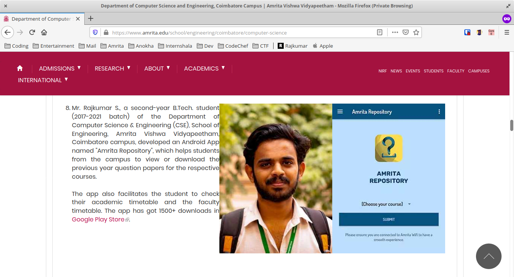

In my first year of college, during the time of examinations more than 60% of my class used to pester those one or two guys who used to download the previous year question papers for reference from an intranet site (which still remains a mystery to most of the students). Being a hard-core techie, I wanted to bring an end to this and hence Amrita Repository was developed. 

It started off as a Python CLI application providing access to only question papers which later extended itself to an android app and a telegram bot with much more helpful features. The suite of apps aim at helping students of Amrita Vishwa Vidyapeetham to find all the materials pertaining to their curriculum of study under one portal with an easy to use interface. It has features including access to previous year question papers, student/faculty timetable, examination schedules, curriculum for various courses, attendance, grades, course resources uploaded by the faculty and latest news regarding the campus. The app has received 8000+ downloads in Play Store as on date, an appreciation letter from the Dean of Engineering, an average of ~4000 monthly active users and great responses from all the students as well as faculty.

### Honours
- Mentioned under **achievements** -> **students** section in the university [website](https://www.amrita.edu/school/engineering/coimbatore/computer-science).

- View the Letter of Appreciation from Dean of Engineering [here](loa-amrita.jpg).

### Links
- Android App
    - Download from [Play Store](http://bit.ly/amritarepo) 
    - View the [source code](https://github.com/rajkumaar23/amrita-repository).

- Telegram Bot 
    - Chat with the bot [here](https://t.me/amrepobot)
        - If the link doesn't work, search for `@amrepobot` on your Telegram app.
    - View the [source code](https://github.com/rajkumaar23/amritarepo-bot).

- Python CLI app
    - View the [source code](https://github.com/rajkumaar23/amritaqpapers)