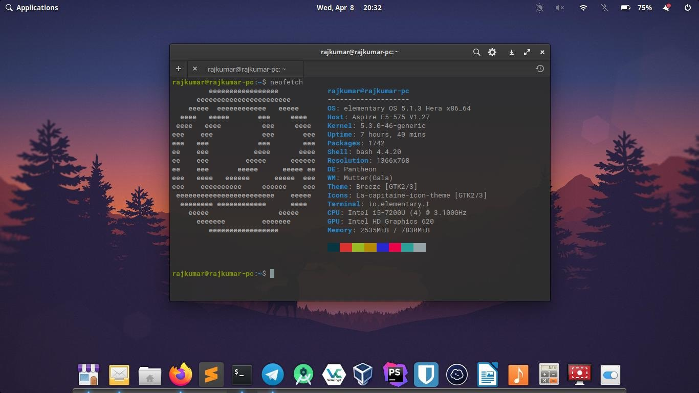
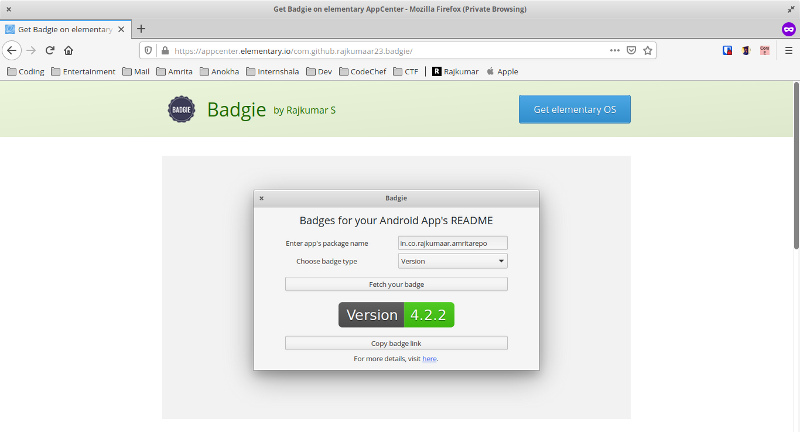

[elementary](https://elementary.io) OS has been my favourite Linux distro for quite a long time because of its beautiful UI, less bloatware which lets me focus on the work that needs to be done. After having used the OS, I wanted to contribute to it in some way or the other. And I started doing so by contributing to a currency converter app called [Moneta](https://appcenter.elementary.io/com.github.matfantinel.moneta/) which is available to download from elementary's AppCenter. [Here](https://github.com/matfantinel/moneta/commits?author=rajkumaar23) is my commit to the same.

I had built a mini playstore [API](https://github.com/rajkumaar23/playstore-api) using Slim PHP sometime back for generating badges for one of my android [app's](/posts/amrita-repository) README file with real-time data from Google Playstore such as Version, Number of Installs, Rating etc. So, I had this crazy idea of building a tiny native GTK app from the scratch for the same. And after around 2 months, Badgie has passed the review and is live on elementary AppCenter [here](https://appcenter.elementary.io/com.github.rajkumaar23.badgie). 

View the source code [here](https://github.com/rajkumaar23/badgie).

