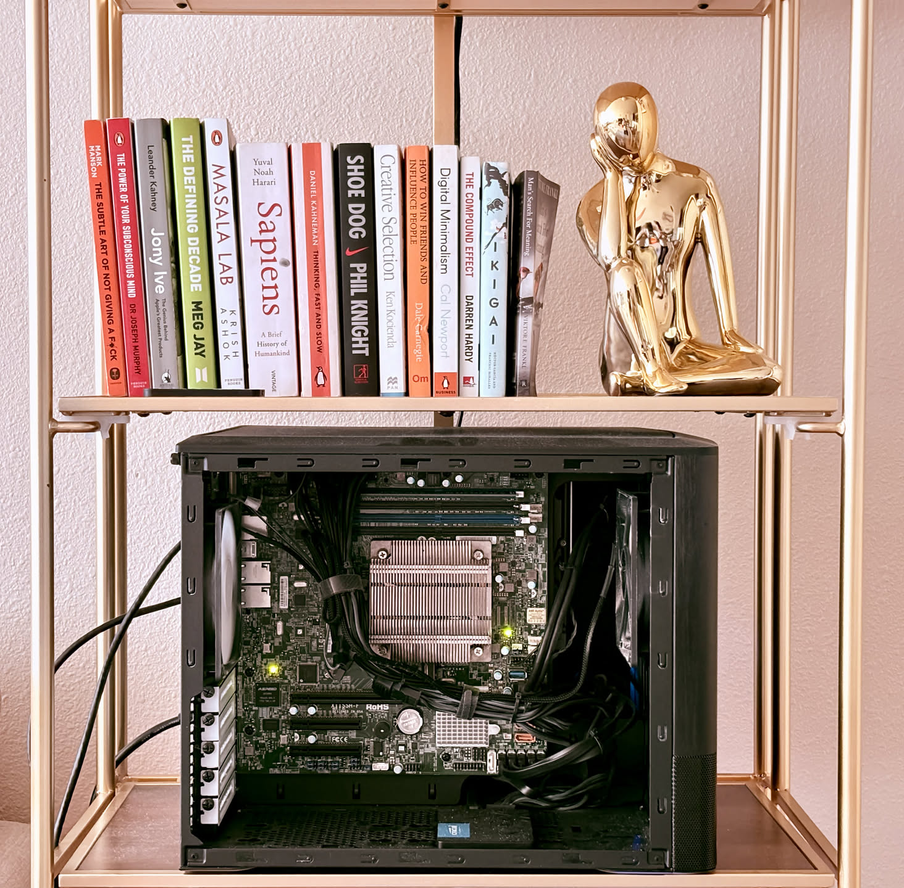

+++
title = 'Network Attached Storage'
date = 2026-08-07T13:12:39-07:00
+++

It has been over 8 months since I built my first NAS server. In fact, that was my first time building a computer from parts. Today, I have 3 of them following [the 3-2-1 rule](https://www.backblaze.com/blog/the-3-2-1-backup-strategy/#:~:text=What%20Is%20the%203%2D2%2D1%20Backup%20Rule?), with 1 primary on-site and 2 off-site backup servers. All of them run TrueNAS Community Edition, and the primary backs up the datasets to the other two servers using [Replication Tasks](https://www.truenas.com/docs/scale/25.10/scaletutorials/dataprotection/replication/) in TrueNAS.

It has been fun gradually gaining trust with my own deployments and moving away from a 200GB iCloud subscription to the free 5GB plan. I've been mostly using the NAS to store photos & videos using [Immich](https://immich.app), and files using [Nextcloud](https://nextcloud.com). There are also a few NFS mounts that my other homelab hosts use to back up docker configuration and volumes.

---
### Primary NAS Build

| Component | Name | Cost |
| :--- | :--- | :--- |
| Motherboard + CPU | Supermicro X11SSH-F + Intel Xeon E3-1220 v6 | $148 |
| RAM | Samsung 16GB DDR4-2400 ECC | $88 |
| HDDs (1 x Mirror) | 2x WD Red Plus 4TB | $221 |
| SSDs (1 x Mirror) | 2x Crucial BX500 240GB | $90 |
| Boot SSD | Kingston A400 240GB | $32 |
| PSU | Seasonic Focus GX-750 | $67 |
| Case | Fractal Design Node 804 | $166 |
| Others | Cables, Thermal Paste etc. | $53 |
| **Total** | - | **$865** |
---
### Secondary (Backup) NAS Build

| Component | Name | Cost |
| :--- | :--- | :--- |
| Motherboard | Supermicro X11SSH-F | $86 |
| CPU | Intel Xeon E3-1225 v6 | $13 |
| RAM | Samsung 16GB DDR4-2400 ECC | $88 |
| HDD | WD Red Plus 8TB | $182 |
| Boot SSD | WD Blue 250GB | $50 |
| PSU | Seasonic CORE GX-650 | $99 |
| Case | Cooler Master MasterBox Q300L | $39 |
| Fan | Thermaltake UX150 | $22 |
| **Total** | - | **$568** |

This secondary instance has no reason to stay awake except when the primary wants to send the backup data. With the help of Claude, I was able to quickly build a Go binary to automate its power management through the IPMI interface. TrueNAS Power Manager is [available on GitHub](https://github.com/rajkumaar23/truenas-power-manager).

---
### Tertiary (Backup) NAS Build

| Component | Name | Cost |
| :--- | :--- | :--- |
| Desktop | Dell OptiPlex 3050 SFF with Intel Core i3-7100 | $109 |
| RAM | Hynix 16GB DDR4-2400 | $78 |
| HDD | WD Blue 8TB | $265 |
| Boot SSD | WD Green 250GB | $32 |
| **Total** | - | **$484** |