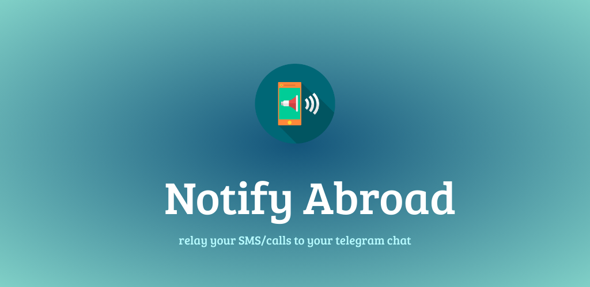

When I came to the US for my master’s, it was an unavoidable need to have access to the OTPs or calls that come to my Indian number, which, by the way, I left at home. Since it was not feasible to make a human relay the OTPs every time the Indian number received one, I built an app to forward them automatically to my Telegram chat and called it ‘Notify Abroad’.

### Download
You can find the latest version of APK on [GitHub](https://github.com/rajkumaar23/notify-abroad/releases/latest).

### Instructions
- Create a Telegram account if you don't have one already, before proceeding to the next step.
- Create a Telegram bot with the help of [Botfather](https://t.me/botfather).
- Note down the token associated with the bot.
  - Do not share this token with anyone.
- Open your bot's chat and press the **START** button.
  - This is important! Otherwise, the bot can't send you any notification.
- With the help of [Chat ID Echo Bot](https://t.me/chatid_echo_bot), note down your own Telegram user ID.
- Open the Notify Abroad app, enter both the token & your user ID and save the settings.
- Hola! All your messages/calls will be forwarded to your Telegram chat.
- **Important** - Some devices prevent the app from running in background to optimize its battery. To override that, you can add Notify Abroad to the battery optimization exemptions.
   - This can usually be done by changing the app's battery optimization setting to "Don't optimize" under Settings > Apps > All apps > Notify Abroad > Battery.
   - Check [this link](https://www.popsci.com/diy/turn-off-battery-saver/) for more details.
- Ensure that the device, this app is installed on, is charged and connected to the internet all the time.

### Source Code

Find the source code on [GitHub](https://github.com/rajkumaar23/notify-abroad).

### Privacy Policy
No analytics, no tracking, and no BS.

This app merely acts as a relay between your device & [Telegram's](https://telegram.org) servers. Apart from that, the app does not do anything with your data. If you would like to read how Telegram processes your data, go [here](https://telegram.org/privacy?setln=en).

### Screenshots

  

