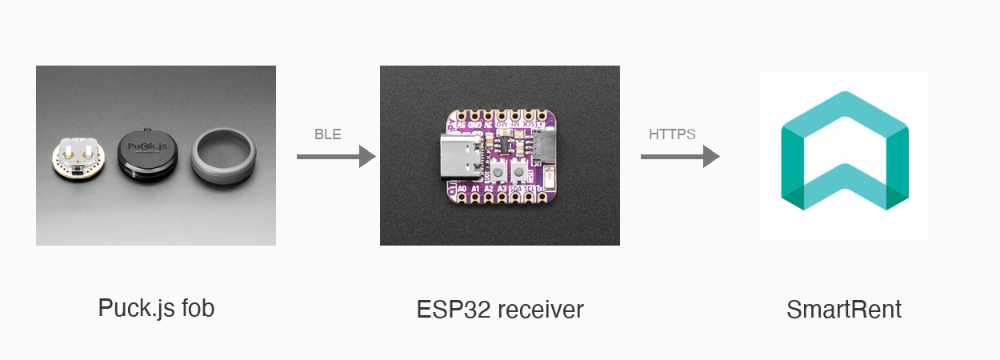

My apartment came with a [SmartRent](https://smartrent.com) lock, and so far I either punched a code into the keypad on the door or unlocked my phone, waited for their app to load, and tapped a button. That is a lot of steps for something I do multiple times a day, and like most of my side projects, this one started purely out of boredom & mild annoyance. After a bit of research I picked up a [Puck.js](https://www.puck-js.com/), a tiny Bluetooth button that runs JavaScript, with exactly this one job in mind: turn it into a single press that unlocks my door.

The setup is a small dance between three things. The Puck.js fob talks over Bluetooth to an ESP32 sitting inside my apartment, and the ESP32 in turn calls the SmartRent cloud API to actually flip the lock. SmartRent does not have a public API, so I had to reverse engineer the endpoints from an existing [Homebridge plugin](https://github.com/BitWise-0x/homebridge-smartrent), including the two factor login flow. Getting it to feel instant was the fun part. I keep a TLS connection to SmartRent warm in the background so an unlock is just a single request, and moved the token refresh off the critical path. On the Bluetooth side I first had the ESP32 hand the fob a random challenge that it had to hash and send back on every press, before realising all that back and forth was costing me a whole round trip, so I switched to the fob sending a time based rolling code instead, which is still safe from a replayed press but needs only one message. Going from the button press to the door clicking open now takes a little over a second, which is a lot nicer than fishing out my phone.

Honestly, half of the work here was staring at serial logs to figure out where the milliseconds were going, and I enjoyed that way more than I expected. It is not a replacement for the building's security, more of a convenience key for a door that is already locked down. If you happen to have a SmartRent lock and a spare microcontroller lying around, the whole thing (the ESP32 receiver & the Puck.js code) is on GitHub [here](https://github.com/rajkumaar23/puck-key).
