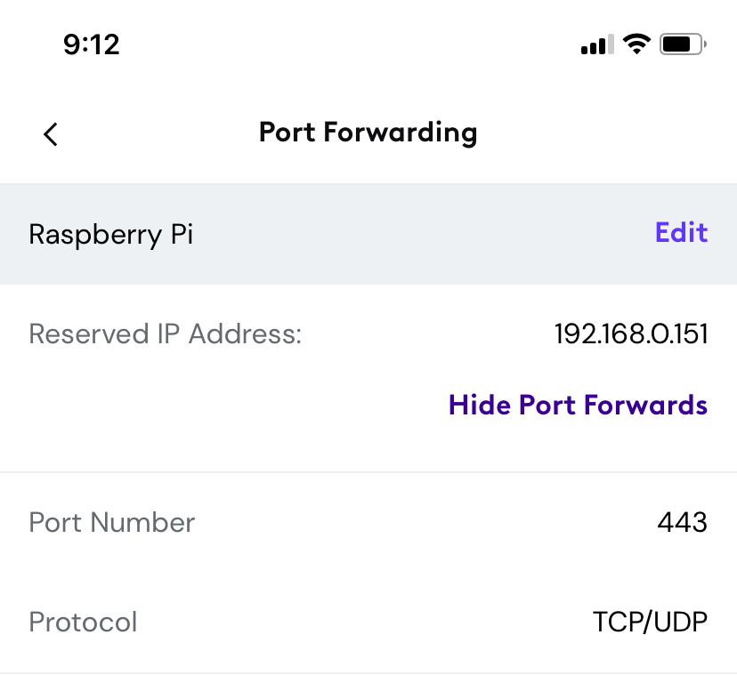
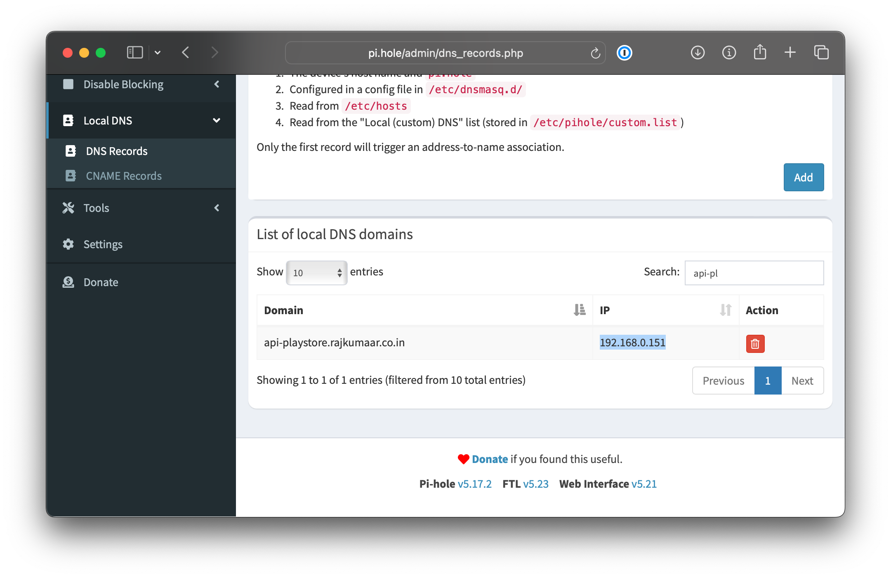

+++
title = 'Hosting web services on my Raspberry Pi'
date = 2023-12-26T20:06:58-07:00
coverAlt = 'An image of the Raspberry Pi 4 from the official website'
+++

It was during COVID-19 that I thought of buying a [Raspberry Pi 4](https://www.raspberrypi.com/products/raspberry-pi-4-model-b/), purely out of boredom. Little did I know that it would power more than a couple of my applications on the internet. Over the past few months, I have had multiple issues efficiently building a setup of serving internet-facing applications from my Pi. This article is a documentation of my current setup that *works*. A good lookback to the year of 2023, I guess?

Some of the applications currently being served from my Raspberry Pi are:
- [Playstore API](https://api-playstore.rajkumaar.co.in)
- [Piped (privacy-friendly YouTube frontend)](https://yt.rajkumaar.co.in)
- [CodeChef Contest Arena - API](https://codechef-arena.rajkumaar.co.in)
- [Amrita Repository - Telegram Bot](https://t.me/amrepobot)

## Web server and Reverse proxy
When you click on any of the above applications, the first thing your browser does is fetch the corresponding IP address mapped to the domain (DNS). Post that, your browser makes a request to the IP with the requested domain as the `hostname`. Since my Pi resides on a home network, the IP you access is that of my Cox gateway. When the request reaches the modem, it is then [redirected](#port-forwarding) to my Pi. 

And then, the `nginx` web server running inside the Pi matches the appropriate virtual host (*based on the hostname from the request*), and the response is generated and sent back. One of my virtual host configuration looks similar to this:
```nginx
server {
	listen 443 ssl;
	listen [::]:443 ssl;
	ssl_certificate /etc/letsencrypt/live/api-playstore.rajkumaar.co.in/fullchain.pem;
    ssl_certificate_key /etc/letsencrypt/live/api-playstore.rajkumaar.co.in/privkey.pem;

	server_name api-playstore.rajkumaar.co.in;

	location / {
		proxy_pass http://127.0.0.1:5003;
        proxy_set_header    Host            $host;
        proxy_set_header    X-Real-IP       $remote_addr;
        proxy_set_header    X-Forwarded-for $remote_addr;
        proxy_connect_timeout 300;
	}
}
```
If you are wondering how I got those TLS certificates from Let's Encrypt, I took advantage of the [DNS challenge](https://letsencrypt.org/docs/challenge-types/#dns-01-challenge) to get the certs for all my domains. [This article](https://www.digitalocean.com/community/tutorials/how-to-acquire-a-let-s-encrypt-certificate-using-dns-validation-with-acme-dns-certbot-on-ubuntu-18-04) by DigitalOcean can be a good start.

## (Dynamic) DNS
I use GoDaddy to manage my DNS and I have an `A` record of `pi.rajkumaar.co.in` that points to my current Cox gateway IP. The tricky part here is that this IP is **not static**, meaning Cox can change it anytime, and the `A` record has to be updated whenever that happens. To deal with this, I have a cron job on my Pi that runs a [simple script](https://gist.github.com/rajkumaar23/ec05d447c76d5245b3f90d676a12b633) every few minutes to check the gateway IP, and update the DNS record if it has changed. 

```bash
#!/bin/bash
# Taken from https://github.com/markafox/GoDaddy_Powershell_DDNS

domain="rajkumaar.co.in"  # your domain
name="pi"                 # name of A record to update
key=""                    # key for godaddy developer API
secret=""                 # secret for godaddy developer API

headers="Authorization: sso-key $key:$secret"

result=$(curl -s -X GET -H "$headers" "https://api.godaddy.com/v1/domains/$domain/records/A/$name")
dnsIp=$(echo $result | grep -oE "\b([0-9]{1,3}\.){3}[0-9]{1,3}\b")

ret=$(curl -s GET "http://ipinfo.io/json")
currentIp=$(echo $ret | grep -oE "\b([0-9]{1,3}\.){3}[0-9]{1,3}\b")

if [ "$dnsIp" != "$currentIp" ];
 then
	request='[{"data":"'$currentIp'","ttl":3600}]'
	nresult=$(curl -i -s -X PUT \
 -H "$headers" \
 -H "Content-Type: application/json" \
 -d $request "https://api.godaddy.com/v1/domains/$domain/records/A/$name")
fi
```

Since I have multiple subdomains pointing to my Pi, I have `CNAME` records for each of them mapping to `pi.rajkumaar.co.in`.

On a high level, it looks like this:

graph LR;
subgraph 'A' record updated by DDNS;
B[pi.rajkumaar.co.in]--A-->Y[My Cox Gateway IP];
end
subgraph 'CNAME' records;
A[api-playstore.rajkumaar.co.in]--CNAME-->B[pi.rajkumaar.co.in];
C[yt.rajkumaar.co.in]--CNAME-->B[pi.rajkumaar.co.in];
D[api.codechef-arena.rajkumaar.co.in]--CNAME-->B[pi.rajkumaar.co.in];
end


## Port forwarding
Now that the DNS is all set, the next step is to configure the Cox modem to be able to forward the requests received on the public gateway IP to my Raspberry Pi. This can be done by setting up port-forwarding for the necessary port(s) using the [Cox Panoramic WiFi app](https://www.cox.com/residential/internet/learn/panoramic-wifi-app.html). Since all my applications are web-based, I forward the port `443` for HTTPS requests. 

The configuration is accessible within the app from the WiFi tab at the bottom → View WiFi equipment → Advanced Settings → Port forwarding → Add port forward.



## NAT reflection and Pi-hole
Even after performing all the above steps, and having the `nginx` web server running on my Pi to listen for requests on the port 443, the setup would **not** work when I am connected to my home network. Digging up a few articles on the internet would teach that it is due to the absence of a feature called [NAT reflection](https://docs.netgate.com/pfsense/en/latest/nat/reflection.html) on my modem. Typically, this is provided only for commercial routers.

Given this limitation, there are 2 ways (that I am aware of) to work around:
- Use a VPN when accessing these applications (if you know how a VPN works, this should make sense).
- Use a [split-horizon DNS](https://ns1.com/resources/split-horizon-or-multiview-dns) setup to resolve the DNS queries to the private IP of my Pi, for those specific domains.

I do not use a VPN to solve this because of the friction associated. I use [NextDNS](https://nextdns.io) on all my devices to prevent ads/tracking at the DNS level, which comes with a [built-in split-horizon](https://github.com/nextdns/nextdns/wiki/Split-Horizon) feature in its CLI. NextDNS is a neat utility that I would highly recommend. 

For this setup to work, a self-hosted DNS server is essential! And installing [pi-hole](https://pi-hole.net) is seamless for this use-case. Next up is to add the local DNS entries on pi-hole for those specific domains.


Now, all that's left is to configure my device to split the DNS requests of those domains to the pi-hole. And that can be done by running the following command using the NextDNS CLI, for each of the domain I want the pi-hole to resolve:
```bash
sudo nextdns config set -forwarder api-playstore.rajkumaar.co.in.=192.168.0.151,45.90.28.176,45.90.30.176
```
The beauty here is that if `192.168.0.151` (pi-hole) fails to resolve the DNS query (*when I am out of my house*), NextDNS would then fallback to subsequent server(s) in the list: `45.90.28.176` and `45.90.30.176`.

## Continous Delivery pipeline
Once the application is exposed to the internet, the final step is to ensure that the deployments are automated. This is as trivial as creating a new user in the Raspberry Pi and authorizing that user to be able to SSH into the Pi to run the necessary commands. If you are thinking how GitHub or any CI would be able to access the Pi, well, the solution is to enable port-forwarding for SSH! 


It is recommended to run SSHd on a custom port instead of the default (22), to reduce any attempts to access your server.
(*Security through obscurity, I know!*)


Since most of my applications are Docker based, an update in a GitHub action looks similar to this:
```bash
ssh -t -p 1234 pi@pi.rajkumaar.co.in 'cd ${{ secrets.APP_DIR }} && docker compose pull && docker compose down && docker compose up -d --remove-orphans'
```
The entire deployment pipeline for [Playstore API](https://api-playstore.rajkumaar.co.in) can be found [here](https://github.com/rajkumaar23/api-playstore/blob/main/.github/workflows/deploy.yaml).

## Other self-hosted apps I use
- [Jellyfin - Media system](https://github.com/jellyfin/jellyfin)
- [Dozzle - Docker log viewer](https://dozzle.dev)
- [GoAccess - Web log analyzer](https://github.com/allinurl/goaccess)
- [AriaNg - Web client for aria2](https://github.com/mayswind/AriaNg)
- [Starbase 80 - Home page to link apps](https://github.com/notclickable-jordan/starbase-80)